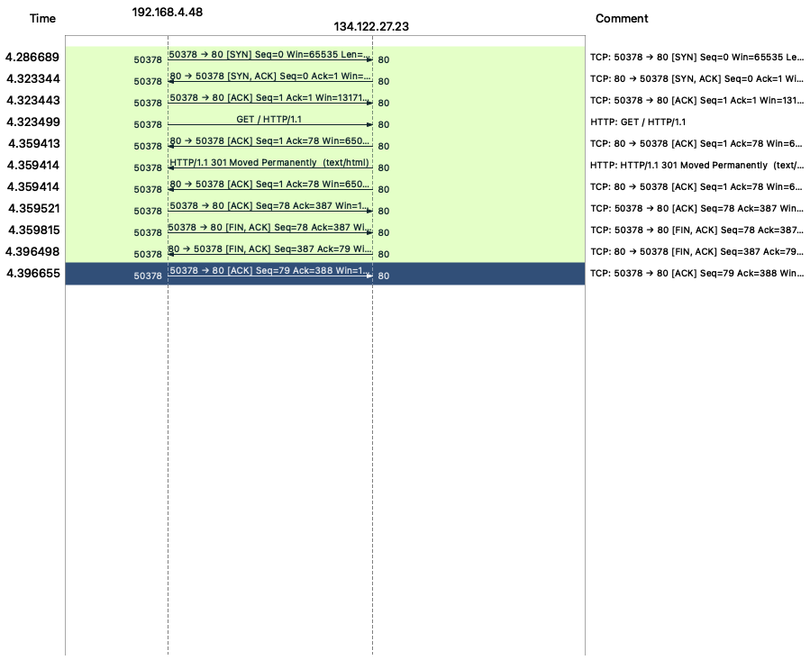

# COP4521

## Authors

Brian Poblete - bap21k

Jayen Lare - jsl19b

Group 9

## Project Notes

The production application is running on Digital Ocean. For development, we
should be running local instances of the server on other machines. This could
be our bare metal machines or on other VMs. These dev machines should have
the same or similar setups to the production machine. That means setting up
Ubuntu 22.04, python3, pip, pipenv, gunicorn, nginx, etc.

## Extra Credit

We will attempt to implement automatic CI/CD with Pulumi.

## Commands 

For local development without nginx: `pipenv run gunilocal`
With nginx (background): `pipenv run guni`
With nginx (foreground + debug mode): `pipenv run gunidebug`

For database

```
flask db stamp head
flask db migrate
flask db upgrade
```

## What does "curl news.brian.pob.me" do?

The Linux command line tool *curl* stands for "Client URL", and is used to enable data transfers over various network protocols. It is able to communicate with a server by specifying a URL and the data that is to be sent or recieved. *curl* is commonly used for debugging, error logging, endpoint testing, and downloading files from the internet. It can be used directly on the command line or in a script, by implementing the following syntax:
```
curl [options/URLs]
```
For our project we were able to utilize the *curl* command, along with Wireshark to better understand the communication involved in accessing our server. We first executed the command: 
```
curl news.brianpob.me
```
This allowed us to build the flowchart shown below using Wireshark. The flowchart showed us the protocols of communications being used are TCP and HTTP, and the IP ports being used are ports 80 and 50378.




## How does Flask object execute Python code?

Below is an example of a basic Flask application
```Python
from flask import Flask    # from the flask package import the Flask class
app = Flask(__name__)      # create an instance of the Flask object called app with __name__
                           # __name__ is passed so the Flask object knows where to look for resources
@app.route('/')            # now we tell Flask what URL should trigger our function
def home():                # we create the function that should be triggered
    return "Hey there!"
if __name__ == '__main__': # if code is run standalone, name is main, execute the Flask app
    app.run(debug=True)    # execute the app
```
[Source 1](https://pythonhow.com/python-tutorial/flask/How-a-Flask-app-works/)

[Source 2](https://flask.palletsprojects.com/en/2.2.x/quickstart/#a-minimal-application)

## Project Security

We disabled password authentication in SSH so that only keys can be used to login. In the server,
we also setup firewall to block all ports by default except for SSH (port 22) and the ports used
by Nginx (80 and 443). In our Nginx configuration, we also set port 80 HTTP to automatically
redirect to port 443 HTTPS.

We obtained an SSL certificate for our site using LetsEncrypt's Certbot so our site can use HTTPS.

## References

https://www.digitalocean.com/community/tutorials/how-to-serve-flask-applications-with-gunicorn-and-nginx-on-ubuntu-22-04

https://blog.miguelgrinberg.com/post/the-flask-mega-tutorial-part-i-hello-world

https://stackoverflow.com/questions/17768940/target-database-is-not-up-to-date


